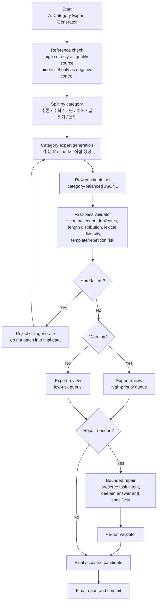

# LogicKor Current Augmentation Pipeline

## Purpose

현재 증강 실험의 목표는 `data/logickor_sft_high.jsonl`과 유사한 품질의 LogicKor SFT 데이터를 추가 생성하는 것이다. 이전 v3 실험은 1차 검수는 통과했지만, 최종 전문가 리뷰에서 semantic template collapse가 발견되어 학습용으로 reject되었다. 따라서 현재 버전은 **A 방식: 카테고리별 expert generator**를 기준으로 재설계한다.

## Core Strategy

현재 채택 전략은 카테고리별 전문가가 처음부터 데이터를 생성하는 방식이다. 단일 생성자가 전체 카테고리를 만든 뒤 고치는 B 방식보다, 카테고리별 문제 구조와 답변 깊이를 처음부터 통제하기 쉽기 때문이다.

- 대상 카테고리: `추론`, `수학`, `코딩`, `이해`, `글쓰기`, `문법`
- 목표 단위: pilot 후 category별 50개 accepted row
- positive reference: `data/logickor_sft_high.jsonl`
- negative control: `data/logickor_sft_middle.jsonl`
- 금지: middle set을 few-shot source로 사용하지 않는다.

## Pipeline



## First-Pass Validation

1차 검수 코드는 최종 품질 판정기가 아니라 **triage gate**다. 명백한 결함을 빠르게 걸러내고, expert review의 우선순위를 정한다.

검수 항목:

- JSONL schema, category count, row count
- duplicate ID, duplicate question
- high set 질문의 exact copy 여부
- placeholder, scaffold, malformed artifact
- category별 답변 길이 분포 이탈
- normalized prefix 반복
- lexical diversity와 top-token repetition
- middle set에 가까운 template-like 위험
- 코딩 카테고리의 반복 코드 구조 위험

예시 명령:

```bash
python3 scripts/validate_augmented_quality.py \
  --reference data/logickor_sft_high.jsonl \
  --candidate data/logickor_sft_high_augmented_candidate.jsonl \
  --expected-per-category 50 \
  --strict-v3 \
  --negative-control data/logickor_sft_middle.jsonl \
  --bootstrap-rounds 100 \
  --report results/augmentation_quality_gate_report.md
```

## Expert Review

`Hard failure`가 없고 `Warning`도 없더라도 바로 최종 학습셋으로 사용하지 않는다. 모든 후보는 카테고리별 expert review를 거친다.

전문가 리뷰 기준:

- high set과 유사한 자연스러운 한국어 문제인가
- 질문이 단순 template substitution이 아닌가
- 두 턴의 질문/답변이 같은 상황과 의도를 유지하는가
- 답변이 얕은 일반론이 아니라 구체적 근거, 계산, 코드, 문법 규칙, 글쓰기 산출물을 제공하는가
- 카테고리 내부에서 문제 family가 충분히 다양한가

## Repair Policy

Repair는 제한적으로만 수행한다. 문제 의도는 보존하되 답변 깊이, 구체성, 근거, 표현 자연성을 보강한다.

다음 경우는 repair가 아니라 재생성이 원칙이다.

- 같은 skeleton이 여러 row에 반복됨
- passage, code task, grammar phenomenon이 실질적으로 중복됨
- 질문과 답변의 상황이 불일치함
- 카테고리 전체가 shallow/template collapse를 보임

## Acceptance Criteria

최종 accepted row는 다음 조건을 모두 만족해야 한다.

- 1차 검수에서 hard failure 없음
- expert review에서 category-level reject 없음
- 필요한 repair 후 validator 재통과
- category별 목표 수량 충족
- 기존 high/middle/v2/v3 row를 rewrite한 것이 아님
- 실패 후보를 durable training output으로 남기지 않음

## Current Decision

현재 다음 scale-up 후보는 **A: category expert generator 방식**이다. v3처럼 validator만 통과한 결과는 학습용 승인으로 보지 않는다. 최종 판단은 validator 결과와 category expert review를 함께 사용한다.
